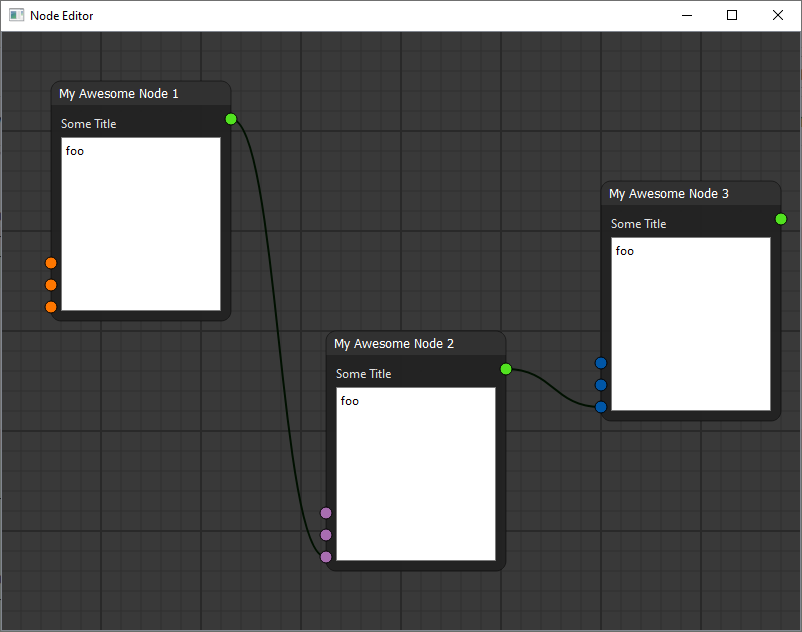

Ongoing project to make a node graph editor with Python & Qt (PySide6).

Based on [the tutorial by Pavel Křupala](https://www.youtube.com/watch?v=xbTLhMJARrk&list=PLZSNHzwDCOggHLThIbCxUhWTgrKVemZkz&index=1).

My goal is to use it to complement a workflow automation application that I want to develop.

